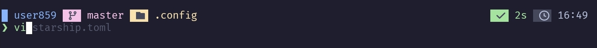

# dotfiles

configs for cli tools i use.

#### list of tools:
- neovim
- helix
- lf
- lazygit (unmodified)
- starship (via zsh)

### theme
catppuccin-mocha from [catppuccin/termux](https://github.com/catppuccin/termux)
